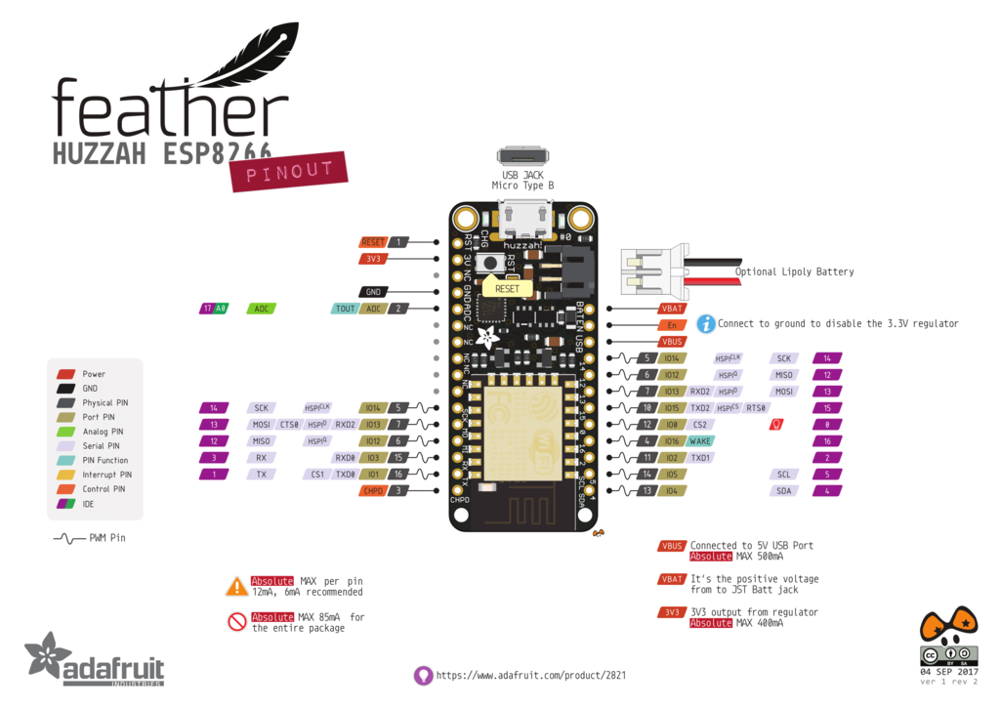

# Smart Collector with Feather Huzzah 

## Project description
Plastic waste collector 

carachetstics:
* WIFI
* stable power supply 

## Hardware

### Components 
* HX711 
* load cells
* LiPo battery with JST connector 
* Button 

### Microcontroller 

### Assembly 
#### Components
* 1 push button 
* 1 resistance 
* 1 Adafruit HUZZAH ESP8266
* 1 load cell
* 1 HX711

#### Special features
 Keep the offest value in a persistent memory using the [RTC Memory Library](https://github.com/fabianoriccardi/rtcmemory) 

## Ressources 
[Feather Huzzah pwer supply](https://learn.adafruit.com/adafruit-feather-huzzah-esp8266/power-management)
